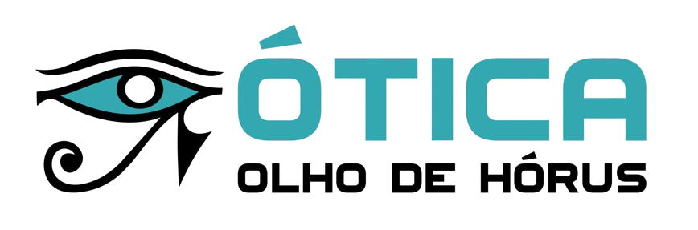
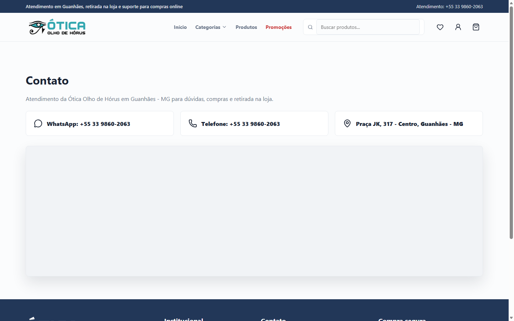

<div align="center">
  

# Ótica Olho de Hórus

**E-commerce full stack desenvolvido para uma operação real do varejo óptico.**

[Acessar o site](https://oticaolhodehorus.com.br) · [Conhecer o autor](https://github.com/jefilds2)
</div>



## Sobre o projeto

A plataforma foi criada para conectar a loja física da Ótica Olho de Hórus à venda e ao atendimento digital. O trabalho cobre a experiência pública de descoberta de produtos, a jornada de compra e uma área administrativa para a operação cotidiana do negócio.

Mais do que uma demonstração técnica, este repositório registra a construção de um produto usado em um contexto comercial real: requisitos do cliente, integrações externas, regras de negócio, responsividade, SEO local, segurança e preparação para produção.

## Principais entregas

- Catálogo com categorias, busca, promoções, favoritos e detalhes dos produtos.
- Carrinho, cupons, endereços, cálculo de frete e acompanhamento de pedidos.
- Checkout integrado ao Mercado Pago.
- Cotação, etiquetas e rastreamento por meio do Melhor Envio.
- Cadastro, autenticação, recuperação de senha e área do cliente.
- Painel administrativo para produtos, categorias, pedidos, cupons e configurações da loja.
- Notificações transacionais por e-mail.
- SEO técnico e local com metadados, canonical, sitemap e dados estruturados.
- Interface responsiva para desktop e dispositivos móveis.

## Tecnologias

| Camada | Tecnologias |
| --- | --- |
| Frontend | React 19, Vite, React Router, Styled Components e Lucide React |
| Backend | Node.js, Express, JWT, bcrypt, Yup e Multer |
| Dados | MariaDB, Sequelize e migrations versionadas |
| Integrações | Mercado Pago, Melhor Envio e Nodemailer |
| Produção | Build estático servido pela API e configuração por variáveis de ambiente |

## Arquitetura

```text
.
├── frontend/             # SPA em React
│   ├── public/           # ativos públicos e configuração do servidor web
│   └── src/              # páginas, componentes, contextos e serviços
├── src/                  # API em Node.js e Express
│   ├── app/              # controllers, models e middlewares
│   ├── config/           # banco, autenticação e integrações
│   ├── database/         # migrations do Sequelize
│   └── services/         # e-mail, frete, cupons e notificações
└── .env.example          # contrato das variáveis de ambiente
```

## Executando localmente

### Pré-requisitos

- Node.js e npm
- MariaDB
- Credenciais de sandbox para integrações que serão testadas

### Instalação

```bash
git clone https://github.com/jefilds2/otica-olho-de-horus.git
cd otica-olho-de-horus
npm install
npm --prefix frontend install
cp .env.example .env
```

No PowerShell, substitua o último comando por `Copy-Item .env.example .env`.

Preencha o `.env`, crie o banco informado na configuração e execute:

```bash
npx sequelize-cli db:migrate
npm run dev
```

Em outro terminal, inicie o frontend:

```bash
npm run dev:site
```

### Produção

```bash
npm run build
npm start
```

Quando `frontend/dist` existe, a API também serve o frontend compilado.

## Configuração e segurança

O arquivo `.env.example` documenta as configurações necessárias sem incluir credenciais operacionais. Banco de dados, uploads e arquivos `.env` não fazem parte do versionamento.

Antes de executar o projeto:

- defina senhas próprias para o MariaDB e um `JWT_SECRET` longo e aleatório;
- use credenciais de sandbox durante o desenvolvimento;
- mantenha tokens do Mercado Pago, Melhor Envio e SMTP somente no ambiente;
- configure `MERCADO_PAGO_WEBHOOK_SECRET` em produção;
- nunca publique bancos, uploads de clientes, dumps ou arquivos `.env`.

## Desenvolvimento com apoio de IA

Ferramentas de inteligência artificial generativa foram usadas como apoio em etapas de planejamento, implementação, investigação de problemas, revisão e documentação.

O uso de IA fez parte do processo de engenharia, com revisão humana e testes sobre as entregas. A definição dos requisitos, as decisões de produto, a validação funcional e a responsabilidade pelo resultado final permaneceram sob responsabilidade do autor.

## Autoria e uso

Desenvolvido por [@jefilds2](https://github.com/jefilds2).

Este repositório é apresentado como portfólio. A marca, o logotipo, as fotografias e os demais materiais comerciais da Ótica Olho de Hórus pertencem aos seus respectivos titulares e não estão licenciados para reutilização.
